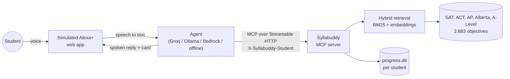

# Syllabuddy

**Ask Alexa what's on your exam, and get the syllabus answer, not a guess.**

Syllabuddy is an MCP server that answers students' most common question,
*"is this even on my exam?"*, straight from the official syllabus. It covers
the **digital SAT and PSAT** (College Board assessment framework), **the ACT**
(College and Career Readiness Standards), **24 US AP
courses** (Course and Exam Descriptions), **Canada's Alberta Diploma** Physics 30
and Chemistry 30, and the **Singapore-Cambridge A-Level**: 2,883 learning
objectives across 47 subjects. It ships with a
simulated Alexa+ experience: you speak, Alexa+ calls Syllabuddy over MCP
(Streamable HTTP), and it answers out loud with the objective code and the
syllabus's own wording on screen.

> **Student:** "Is the ratio test on the AP Calculus AB exam?"
>
> **Alexa+** → `check_examinable(topic="ratio test", subject="AP Calc AB")`
>
> **Alexa+:** "No, the ratio test is only assessed on the AP Calculus BC exam."
>
> **Student:** "What about BC?" → "Yes, it's topic 10.8 of AP Calculus BC, Ratio Test for Convergence."

Built for the **Alexa+ track** of the Amazon Developer Hackathon (Build, Ship, Shape, 2026).

---

## Why

General-purpose assistants are good at explaining things and bad at knowing what
your exam actually covers. Ask one whether something is examinable and it will
guess confidently. The real answer is usually one bullet point, on one page of a
40-page PDF, under *Excluded*.

**Who it's for.** In the US high-school class of 2025 alone, more than 2 million
students took the SAT ([College Board](https://newsroom.collegeboard.org/sat-participation-class-2025-surpasses-2-million-test-takers-first-time-2020)),
1,380,130 took the ACT ([ACT](https://www.act.org/content/dam/act/unsecured/documents/2025-act-profile-report-us.pdf)),
and 1,307,781 public-school graduates took more than 4.8 million AP exams
([College Board](https://newsroom.collegeboard.org/class-2025-builds-decade-gains-ap-participation-and-performance)).
Every one of them has a syllabus that says what is, and isn't, on the test.
Syllabuddy puts that answer one question away, by voice, on a device already in
millions of homes.

Syllabuddy never guesses about the syllabus. Its tools don't call a language
model at all: they search **2,883 learning objectives parsed deterministically
from the official documents**, including every exclusion statement, every "bc
only" marker and every boundary statement, and return the exact wording with its
source page. The assistant only does the talking.

| Exam | Subjects | Objectives | Source |
|---|---|---|---|
| **SAT Suite** (US, College Board) | 3: SAT Reading and Writing, SAT Math (also used for PSAT/NMSQT and PSAT 10), PSAT 8/9 Math | 46 skills, 200 testing points | Assessment Framework for the Digital SAT Suite, Appendix B |
| **ACT** (US) | 4: English, Math, Reading, Science | 456 coded standards, each its own objective, grouped by strand and score range | College and Career Readiness Standards |
| **AP** (US, College Board) | 24: Calculus AB and BC, Precalculus, Statistics, Physics 1, 2, C: Mechanics, C: E&M, Chemistry, Biology, Environmental Science, CS A, CS Principles, Psychology, Macro, Micro, US Gov, Comparative Gov, US History, World History, European History, Human Geography, African American Studies, Music Theory | 1,447 | Course and Exam Descriptions |
| **Alberta Diploma** (Canada) | Physics 30, Chemistry 30 | 18 general outcomes, 124 knowledge outcomes | Alberta Education Programs of Study |
| **Singapore-Cambridge A-Level** | 14 (H1/H2 sciences, maths, computing, humanities) | 916 | SEAB syllabus PDFs |

AP courses with no content topics (world languages, English Language and
Literature, Seminar, Research, Art and Design) and Art History (a list of
artworks rather than objectives) are not included. Alberta Biology 30 and
Mathematics 30-1 are not included yet: their documents refuse automated download.

It also remembers what Alexa+ can't: **which exams you're taking and when**, and
**which objectives you personally keep getting wrong**. Say "I'm taking AP Calc
BC and the SAT, my exam is May 11" once; after that every question is checked
against those syllabuses, and "what should I revise first?" comes back with your
weak spots, how much of each syllabus you've practised, and the days left.

## What you can ask

| Say | Syllabuddy tool | What happens |
|---|---|---|
| "Is calculus on the SAT?" | `check_examinable` | **Not in the syllabus**: the SAT stops before calculus |
| "Is multiplying matrices on the ACT?" | `check_examinable` | **Examinable**: ACTM-1.705, "N 705: Multiply matrices", Number and Quantity, score 33–36 |
| "Are circles on the PSAT 8/9?" | `check_examinable` | **Excluded**: SAT and PSAT/NMSQT only (SATM-4.4 is examinable on the SAT) |
| "Is the ratio test on the AP Calculus AB exam?" | `check_examinable` | **Excluded**: BC only (the CED marks it "bc only") |
| "Do I need the epsilon-delta definition of a limit for AP Calc?" | `check_examinable` | **Excluded**, quoting the CED's exclusion statement (CALCAB-1.2) |
| "Is Big-O notation on AP CS Principles?" | `check_examinable` | **Excluded**: "formal analysis of algorithms (Big-O)... outside the scope" |
| "Is the photoelectric effect on the Physics 30 diploma?" | `check_examinable` | **Examinable**, Alberta outcome PHYS30-C2 |
| "Is the shortest distance between two skew lines on the H2 Maths exam?" | `check_examinable` | **Excluded**, quoting 9758.3.3 |
| "Do I need to know Type II error?" | `check_examinable` | **Excluded**, quoting the packed bullet in 9758.6.5 |
| "Is hypothesis testing examinable?" | `check_examinable` | **Examinable**, objective 9758.6.5 |
| "Explain simple harmonic motion for H2 Physics" | `find_objective` | Explains within objective 9478.9.d |
| "Quiz me on H2 Computing" | `start_quiz` → `record_quiz_result` | One spoken question, marked, saved |
| "I'm taking AP Calc BC and the SAT, my exam is May 11" | `set_my_courses` | Saved; later questions without a subject use these courses |
| "What should I revise first?" | `my_revision_list` | Your weakest objectives, syllabus progress per course, and days to the exam |

## How it works



1. **Parsing (deterministic).** `syllabus_core/syllabus/` has one parser per document layout. `ap_ced.py` reads every AP Course and Exam Description: it locates the learning-objective and essential-knowledge columns on each page from their headings (facing pages are mirrored), handles three generations of codes (`LIM-1.A`, `1.1.A`, history `KC-4.1.IV.C`), captures exclusion and physics boundary statements, turns "bc only" content into AP Calculus AB exclusions, regroups CS Principles by its at-a-glance tables, and strips footers, formula alt text and letter-spacing damage. `alberta.py` reads the 30-level general and knowledge outcomes. `act.py` reads ACT's coded standards (`N 705. Multiply matrices`), where the hundreds digit is the score range, and keeps each standard as an objective under its strand and score range. `sat.py` reads the SAT Suite framework's testing-point tables: it finds each page's column edges from the header row and the most common left margins, rebuilds statements, bullets and sub-bullets from indentation, keeps exponents (`k^2`), and compares the SAT and PSAT 8/9 columns bullet by bullet, so content the PSAT 8/9 leaves out becomes a PSAT 8/9 exclusion. For the Singapore A-Level, Single-column science and maths syllabuses are read line by line. Multi-column History, Geography and Economics tables are split back into columns before parsing. `syllabus_core/pdf_text.py` repairs scrambled glyph order and recovers super- and subscripts (`ax^2`, `u_{n+1}`) from font size and baseline.
2. **Retrieval.** BM25 and dense embeddings (`BAAI/bge-small-en-v1.5`, in-process ONNX) are fused with Reciprocal Rank Fusion. The best cosine similarity gives a calibrated confidence: below 0.58 is treated as off-syllabus.
3. **Examinability.** Every "Excluded" bullet is indexed on its own, and packed bullets are split into clauses. An exclusion wins only when it matches the question better than anything *included*, and only inside its own topic. That is why "hypothesis testing" is examinable even though correlation's objective excludes "hypothesis tests". Short technical terms ("Type II error") are also matched word for word, because they embed poorly.
4. **MCP server.** `mcp_server/server.py` exposes 10 tools, 3 resources (`syllabus://subjects`, `syllabus://subject/{id}`, `syllabus://objective/{id}`) and 2 prompts (`revision_plan`, `is_it_on_my_exam`) via the official MCP Python SDK. It negotiates spec **2025-11-25** over Streamable HTTP (2026-07-28 is also supported). Once warm, tool calls took 14 to 300 ms in testing on a 2-core laptop, inside Alexa+'s 500 ms budget. Query embedding dominates that time, so a normal server is faster.
5. **Simulated Alexa+.** `assistant/` is a Starlette app with a voice UI (Web Speech API), an agent that connects to the MCP server as a real MCP client, and a swappable model ("brain").

## Quick start

Needs Python 3.11+ (tested on 3.13, Windows 11).

```bash
git clone https://github.com/fahad208177-tech/Syllabuddy.git syllabuddy && cd syllabuddy
python -m venv .venv
.venv\Scripts\activate            # macOS/Linux: source .venv/bin/activate
pip install -r requirements.txt
python run.py                     # starts the MCP server + the app, opens http://127.0.0.1:8000
```

The first start downloads a 65 MB embedding model. With no configuration, the app
runs in **offline mode**: no model and no keys, just a simple intent router, but
still fully working through MCP. For natural conversation, pick a brain in
`.env` (copy `.env.example`):

| Brain | Set in `.env` |
|---|---|
| **Groq** / any OpenAI-compatible API (used for the demo) | `SYLLABUDDY_BRAIN=openai`, `SYLLABUDDY_LLM_BASE_URL`, `SYLLABUDDY_LLM_API_KEY`, `SYLLABUDDY_LLM_MODEL` |
| Amazon Bedrock (optional; implemented and tested with a stubbed client, not yet run against a live account) | `SYLLABUDDY_BRAIN=bedrock`, AWS credentials, `BEDROCK_MODEL_ID` (default `us.amazon.nova-pro-v1:0`) |
| Ollama (fully local) | `SYLLABUDDY_BRAIN=openai`, `SYLLABUDDY_LLM_BASE_URL=http://localhost:11434/v1`, a tool-calling model |

**Speed.** A turn is about 2 s of model time plus a few milliseconds of MCP. Groq's free tier allows roughly two turns a minute (8,000 tokens per minute), so rapid-fire questions wait. When the model is rate-limited, slow or down, that turn is answered straight from the syllabus by the offline brain instead of failing, and no turn waits more than about 40 s.

Voice input needs Chrome or Edge. Hold the mic button, or hold Space, to talk. You can always type instead.

### Use Syllabuddy from any MCP client

```bash
python -m mcp_server              # http://127.0.0.1:8765/mcp
```

The repo includes `.mcp.json`, so Claude Code picks the server up automatically,
and an [Agent Skill](skills/syllabuddy/SKILL.md) that teaches any agent when and
how to use each tool. Other clients: add a Streamable HTTP server at
`http://127.0.0.1:8765/mcp`. To keep history per student, send an
`X-Syllabuddy-Student` header. A bearer token is also accepted and is stored
only as a hash.

## Tools

| Tool | Purpose |
|---|---|
| `check_examinable(topic, subject?)` | `excluded` / `examinable` / `unclear` / `not_in_syllabus`, with the syllabus wording |
| `find_objective(question, subject?)` | Best matching objectives, with what they require and exclude, source page and confidence |
| `get_objective(objective_id)` | Full details of one objective, e.g. `9758.3.3` |
| `list_subjects()` / `list_topics(subject)` | What's loaded |
| `start_quiz(subject?, objective_id?)` | Picks your weakest (or an unseen) objective to quiz on |
| `record_quiz_result(objective_id, correct, note?)` | Saves the result to your history |
| `set_my_courses(courses, exam_date?)` | Remembers the student's exams and exam date; questions without a subject then search only those |
| `my_revision_list()` | Objectives to revise first (wrong answers, then repeated questions), progress through each saved course, days to the exam |
| `clear_my_history(confirm?)` | Deletes everything stored about the student, including saved courses. Two steps enforced by the server, so a model can't delete without the student confirming |

Subjects can be named loosely: "SAT", "SAT math", "PSAT 8/9", "ACT", "ACT science", "AP Calc AB", "APUSH", "AP Chem", "stats", "Physics C E&M", "Physics 30", "H2 Maths", "econs", or a code like "9729" or "CALCBC". Plain names ("chem", "physics") mean the Singapore A-Level unless "AP", "30" or "Alberta" is said.

## Tests

```bash
pytest -q                         # 182 tests: SAT, ACT, AP, Alberta and A-Level answers, paraphrases, MCP over HTTP, account linking, agent loop, fallbacks, web API
python scripts/eval_all.py        # tests every one of the 2,883 objectives (writes artifacts/eval_report.md)
python scripts/eval_examinable.py # Singapore A-Level only: every Excluded bullet and objective title (942 cases)
python scripts/eval_examinable.py --paraphrases   # 25 student-style phrasings
python scripts/live_check.py "Is type II error examinable in H2 maths?"     # against the running app
python scripts/ui_check.py        # drives the UI in Chrome (needs playwright)
python scripts/record_demo.py     # records the demo script as artifacts/demo_capture.mp4
python scripts/check_bedrock.py   # optional: verifies AWS credentials and a real Bedrock tool call
```

**Every objective, every exam** (`scripts/eval_all.py`, 2,883 objectives in 47 subjects, about 10 to 15 minutes): data quality 100% (no PDF debris, scattered formulas, empty or duplicate objectives), every objective's title comes back `examinable` (2,754/2,754), every exclusion statement comes back `excluded` (164/164), and each objective's own first requirement finds it in the top 3 for 99% (94% first). Most top-3 misses are AP Calculus topics that share identical learning objectives (topics 10.1 to 10.8 all say "Determine whether a series converges or diverges").

**Known limitation.** The AP Precalculus PDF lays out formulas as positioned glyphs, and its text layer scatters them ("x t( )" for x(t), sum identities out of order). 10 such statements across AP Precalculus, AP Physics C and Alberta Physics 30 are corrected by hand in `data/corrections.json` (with 6 earlier A-Level fixes), each checked against its PDF page; about 35 more, mostly in AP Precalculus, still read oddly in the formula part. The words around them are intact, so search and verdicts work, but the formula text on the card is garbled.

**Singapore A-Level detail.** On the full syllabus, 36/36 Excluded bullets come back `excluded` and 906/906 objective titles come back `examinable`. Two bullets ("hypothesis tests", excluded only from correlation) are skipped as ambiguous out of context. On 25 student-style paraphrases, such as "implicit differentiation" (excluded in H1, taught in H2) or "doubly linked lists" next to "linked lists", it scores 25/25.

**Question-to-objective matching** (`python scripts/eval_retrieval.py`, 51 labelled questions carried over from the original tutor): with the subject given, 86% top-1 and MRR 0.925, and the right objective is in the top 3 every time (`find_objective` returns 3). The remaining top-1 misses are sibling objectives in the same topic, for example "construct and use rate equations" ranked above "explain and use the terms rate of reaction, order...".

The examinability tests are checked against the syllabus itself. For example:
skew lines are examinable, but the *shortest distance* between them is excluded;
hypothesis testing is examinable, but Type I and II errors are not. The Bedrock
path is tested with a stubbed Converse client, including the tool-use and
tool-result message shapes.

## Project layout

```
mcp_server/        MCP server (Streamable HTTP): 10 tools, 3 resources, 2 prompts
syllabus_core/     parsers, retrieval, examinability logic, per-student progress
assistant/         simulated Alexa+: agent (MCP client + brains) and voice web UI
skills/syllabuddy/ Agent Skill for any skills-compatible agent
data/              syllabus.json (Singapore, 916), ap_syllabus.json (AP, 1,447), alberta_syllabus.json (18),
                   sat_syllabus.json (SAT Suite, 46), act_syllabus.json (ACT, 456),
                   corrections.json (6 PDF-mangled bullets, fixed), precomputed embeddings
scripts/           build_syllabus.py (PDFs → JSON), live and UI checks
tests/             pytest suite
```

## Deploy (one container, one port)

`python -m deploy.serve` (or the `Dockerfile`) runs everything on one port, the
way a public host needs it:

| Path | What |
|---|---|
| `/` | the voice web app |
| `/mcp` | the MCP server, for Alexa+, Claude or any MCP client |
| `/.well-known/oauth-*`, `/register`, `/authorize`, `/token`, `/revoke` | OAuth 2.1 account linking (PKCE, dynamic client registration) |
| `/link` | the sign-in page a student sees when linking |

**Hugging Face Spaces** (Docker Spaces now need a PRO subscription): `pip install huggingface_hub`, set `HF_TOKEN` to a
write token, then `python deploy/publish_space.py`. It creates the Space, uploads
the code and data (never `.env` or the database), stores the model API key as a
Space secret, and prints the web app and MCP links. The Space builds in 5 to 10
minutes. Free Spaces have no persistent disk, so accounts reset on restart.

## Account linking

When `SYLLABUDDY_PUBLIC_URL` is set (or `SPACE_HOST` on Hugging Face), Syllabuddy
is also an OAuth 2.1 authorization server, built on the MCP SDK's auth support
(`mcp_server/accounts.py`). A client such as Alexa+ account linking or Claude
discovers it from the 401 on `/mcp`, registers itself, and sends the student to
`/link` to sign in with a username and PIN (created on first use; no email or
real name). Tokens are bound to that account, so **the same revision list and
saved courses follow the student from Alexa+ to the web app to any other client**.
Tokens and codes are stored only as SHA-256 hashes, PINs as salted scrypt
hashes; refresh tokens rotate; "clear my history" also deletes the account.
`tests/test_accounts.py` runs the whole flow, including a second device.

## Real Alexa+ add-on package

`alexa-addon/addon.json` follows the MCP Toolkit manifest format: store listing, 4 example phrases, privacy and terms URLs (served at `/privacy` and `/terms`), and icons at all 6 required sizes (`alexa-addon/media/`). Replace `YOUR-SYLLABUDDY-HOST` with the deployed HTTPS host, then `alexa-ai deploy`. Account linking is implemented (above); what remains is Amazon's allow-listed Alexa AI CLI, see [docs/FRICTION_LOG.md](docs/FRICTION_LOG.md).

## Roadmap

- **Real Alexa+ add-on.** The server, account linking and manifest are ready; publishing needs the allow-listed Alexa AI CLI (`alexa-ai new mcp`, `alexa-ai deploy`).
- **More exams.** Any exam with a published syllabus fits the same model: GED, CLEP and IB are next.
- **Past-paper quizzes** tied to each objective.

## Built before vs during the hackathon

- **Before (31 Aug 2026):** the syllabus parsers, `syllabus.json`, and the hybrid retrieval, from my earlier A-Level tutor project.
- **During:** the SAT Suite and ACT parsers, the AP parser (24 courses, 1,447 objectives) and Alberta parser; the MCP server, all 10 tools, resources and prompts; OAuth 2.1 account linking and one-port deployment; saved courses and exam countdown; the examinability engine (exclusion and inclusion indexes, clause splitting, parent-topic check, literal matching); per-student progress and quizzes; the agent with OpenAI-compatible (Groq), offline and optional Bedrock brains; the simulated Alexa+ voice UI; the Agent Skill; the tests; deployment files.

## Notes on data

The data files are derived from publicly available documents, for educational
use: SEAB A-Level syllabuses, College Board AP Course and Exam Descriptions (©
College Board), the Assessment Framework for the Digital SAT Suite (© College Board),
ACT's College and Career Readiness Standards (© ACT, Inc.) and Alberta Education Programs of Study. The PDFs themselves are
not redistributed; objectives keep their source page so every answer can be
checked. To rebuild, download the PDFs into `syllabus_pdfs/` (see the docstrings
of `scripts/build_syllabus.py`, `build_ap.py` and `build_alberta.py`) and run those
scripts. Syllabuddy is not affiliated with or endorsed by SEAB, Cambridge, the
College Board, Alberta Education, or Amazon.
"Alexa+" here refers to a simulated experience built for the hackathon's Alexa+ track.

## License

MIT, see [LICENSE](LICENSE).
