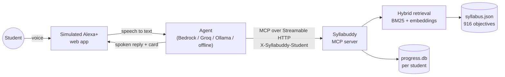

# Syllabuddy

**Ask Alexa what's on your exam, and get the syllabus answer, not a guess.**

Syllabuddy is an MCP server that answers A-Level students' most common question,
*"is this even in the syllabus?"*, straight from the official exam syllabus. It
ships with a simulated Alexa+ experience: you speak, Alexa+ calls Syllabuddy over
MCP (Streamable HTTP), and it answers out loud with the objective code and the
syllabus's own wording on screen.

> **Student:** "Is the shortest distance between two skew lines on the H2 Maths exam?"
>
> **Alexa+** → `check_examinable(topic="shortest distance between two skew lines", subject="H2 Maths")`
>
> **Alexa+:** "No, it's not examinable. Objective 9758.3.3 explicitly excludes the shortest distance between two skew lines."

Built for the **Alexa+ track** of the Amazon Developer Hackathon (Build, Ship, Shape, 2026).

---

## Why

General-purpose assistants are good at explaining things and bad at knowing what
your exam actually covers. Ask one whether something is examinable and it will
guess confidently. The real answer is usually one bullet point, on one page of a
40-page PDF, under *Excluded*.

Syllabuddy never guesses about the syllabus. Its tools don't call a language
model at all: they search **916 learning objectives parsed deterministically from
the official SEAB syllabus PDFs** (14 subjects, H1 and H2), including every
"Include" and "Exclude" list, and return the exact wording with its source page.
The assistant only does the talking.

It also remembers what Alexa+ can't: **which objectives you personally keep
getting wrong**, so "what should I revise first?" has a real answer.

## What you can ask

| Say | Syllabuddy tool | What happens |
|---|---|---|
| "Is the shortest distance between two skew lines on the H2 Maths exam?" | `check_examinable` | **Excluded**, quoting 9758.3.3 |
| "Do I need to know Type II error?" | `check_examinable` | **Excluded**, quoting the packed bullet in 9758.6.5 |
| "Is hypothesis testing examinable?" | `check_examinable` | **Examinable**, objective 9758.6.5 |
| "Explain simple harmonic motion for H2 Physics" | `find_objective` | Explains within objective 9478.9.d |
| "Quiz me on H2 Computing" | `start_quiz` → `record_quiz_result` | One spoken question, marked, saved |
| "What should I revise first?" | `my_revision_list` | Your weakest objectives, from your history |

## How it works



1. **Parsing (deterministic).** `syllabus_core/syllabus/` has one parser per syllabus layout. Single-column science and maths syllabuses are read line by line. Multi-column History, Geography and Economics tables are split back into columns before parsing. `syllabus_core/pdf_text.py` repairs scrambled glyph order and recovers super- and subscripts (`ax^2`, `u_{n+1}`) from font size and baseline.
2. **Retrieval.** BM25 and dense embeddings (`BAAI/bge-small-en-v1.5`, in-process ONNX) are fused with Reciprocal Rank Fusion. The best cosine similarity gives a calibrated confidence: below 0.58 is treated as off-syllabus.
3. **Examinability.** Every "Excluded" bullet is indexed on its own, and packed bullets are split into clauses. An exclusion wins only when it matches the question better than anything *included*, and only inside its own topic. That is why "hypothesis testing" is examinable even though correlation's objective excludes "hypothesis tests". Short technical terms ("Type II error") are also matched word for word, because they embed poorly.
4. **MCP server.** `mcp_server/server.py` exposes 8 tools via the official MCP Python SDK. It negotiates spec **2025-11-25** over Streamable HTTP (2026-07-28 is also supported). Once warm, tool calls took 14 to 300 ms in testing on a 2-core laptop, inside Alexa+'s 500 ms budget. Query embedding dominates that time, so a normal server is faster.
5. **Simulated Alexa+.** `assistant/` is a Starlette app with a voice UI (Web Speech API), an agent that connects to the MCP server as a real MCP client, and a swappable model ("brain").

## Quick start

Needs Python 3.11+ (tested on 3.13, Windows 11).

```bash
git clone <this repo> syllabuddy && cd syllabuddy
python -m venv .venv
.venv\Scripts\activate            # macOS/Linux: source .venv/bin/activate
pip install -r requirements.txt
python run.py                     # starts the MCP server + the app, opens http://127.0.0.1:8000
```

The first start downloads a 65 MB embedding model. With no configuration, the app
runs in **offline mode**: no model and no keys, just a simple intent router, but
still fully working through MCP. For natural conversation, pick a brain in
`.env` (copy `.env.example`):

| Brain | Set in `.env` |
|---|---|
| **Amazon Bedrock** (recommended) | `SYLLABUDDY_BRAIN=bedrock`, AWS credentials, `BEDROCK_MODEL_ID` (default `us.amazon.nova-pro-v1:0`) |
| Groq / any OpenAI-compatible API | `SYLLABUDDY_BRAIN=openai`, `SYLLABUDDY_LLM_BASE_URL`, `SYLLABUDDY_LLM_API_KEY`, `SYLLABUDDY_LLM_MODEL` |
| Ollama (fully local) | `SYLLABUDDY_BRAIN=openai`, `SYLLABUDDY_LLM_BASE_URL=http://localhost:11434/v1`, a tool-calling model |

**Speed.** A turn is about 2 s of model time plus a few milliseconds of MCP. Groq's free tier allows roughly two turns a minute (8,000 tokens per minute), so rapid-fire questions wait. When the model is rate-limited or down, that turn is answered straight from the syllabus by the offline brain instead of failing. Bedrock has no such limit.

Voice input needs Chrome or Edge. Hold the mic button, or hold Space, to talk. You can always type instead.

### Use Syllabuddy from any MCP client

```bash
python -m mcp_server              # http://127.0.0.1:8765/mcp
```

The repo includes `.mcp.json`, so Claude Code picks the server up automatically,
and an [Agent Skill](skills/syllabuddy/SKILL.md) that teaches any agent when and
how to use each tool. Other clients: add a Streamable HTTP server at
`http://127.0.0.1:8765/mcp`. To keep history per student, send an
`X-Syllabuddy-Student` header. A bearer token is also accepted and is stored
only as a hash.

## Tools

| Tool | Purpose |
|---|---|
| `check_examinable(topic, subject?)` | `excluded` / `examinable` / `unclear` / `not_in_syllabus`, with the syllabus wording |
| `find_objective(question, subject?)` | Best matching objectives, with what they require and exclude, source page and confidence |
| `get_objective(objective_id)` | Full details of one objective, e.g. `9758.3.3` |
| `list_subjects()` / `list_topics(subject)` | What's loaded |
| `start_quiz(subject?, objective_id?)` | Picks your weakest (or an unseen) objective to quiz on |
| `record_quiz_result(objective_id, correct, note?)` | Saves the result to your history |
| `my_revision_list()` | Objectives to revise first, ranked by wrong answers, then repeated questions |

Subjects can be named loosely: "H2 Maths", "h1 physics", "econs", "computing", or a code like "9729".

## Tests

```bash
pytest -q                         # 82 tests: syllabus answers, student paraphrases, MCP over HTTP, agent loop, Bedrock plumbing, web API
python scripts/eval_examinable.py # every Excluded bullet and every objective title in the syllabus (942 cases)
python scripts/eval_examinable.py --paraphrases   # 25 student-style phrasings
python scripts/live_check.py "Is type II error examinable in H2 maths?"     # against the running app
python scripts/ui_check.py        # drives the UI in Chrome (needs playwright)
```

**Accuracy.** On the full syllabus, 36/36 Excluded bullets come back `excluded` and 906/906 objective titles come back `examinable`. Two bullets ("hypothesis tests", excluded only from correlation) are skipped as ambiguous out of context. On 25 student-style paraphrases, such as "implicit differentiation" (excluded in H1, taught in H2) or "doubly linked lists" next to "linked lists", it scores 25/25.

**Question-to-objective matching** (`python scripts/eval_retrieval.py`, 51 labelled questions carried over from the original tutor): with the subject given, 86% top-1 and MRR 0.925, and the right objective is in the top 3 every time (`find_objective` returns 3). The remaining top-1 misses are sibling objectives in the same topic, for example "construct and use rate equations" ranked above "explain and use the terms rate of reaction, order...".

The examinability tests are checked against the syllabus itself. For example:
skew lines are examinable, but the *shortest distance* between them is excluded;
hypothesis testing is examinable, but Type I and II errors are not. The Bedrock
path is tested with a stubbed Converse client, including the tool-use and
tool-result message shapes.

## Project layout

```
mcp_server/        MCP server (Streamable HTTP) and its 8 tools
syllabus_core/     parsers, retrieval, examinability logic, per-student progress
assistant/         simulated Alexa+: agent (MCP client + brains) and voice web UI
skills/syllabuddy/ Agent Skill for any skills-compatible agent
data/              syllabus.json (916 objectives), corrections.json (6 PDF-mangled bullets, fixed), precomputed embeddings
scripts/           build_syllabus.py (PDFs → JSON), live and UI checks
tests/             pytest suite
```

## Roadmap

- **Real Alexa+ add-on.** Deploy the MCP server (the Dockerfile binds `0.0.0.0:8765`, ready for App Runner or ECS), add OAuth 2.1 with PKCE account linking, and publish with the Alexa AI CLI (`alexa-ai new mcp`, `alexa-ai deploy`). Student identity would come from the OAuth token instead of the header.
- **More exams.** Any exam with a published syllabus fits the same model, for example Cambridge International A Levels and AP courses.
- **Past-paper quizzes** tied to each objective.

## Built before vs during the hackathon

- **Before (31 Aug 2026):** the syllabus parsers, `syllabus.json`, and the hybrid retrieval, from my earlier A-Level tutor project.
- **During:** the MCP server and all 8 tools; the examinability engine (exclusion and inclusion indexes, clause splitting, parent-topic check, literal matching); per-student progress and quizzes; the agent with Bedrock, OpenAI-compatible and offline brains; the simulated Alexa+ voice UI; the Agent Skill; the tests; deployment files.

## Notes on data

`data/syllabus.json` is derived from the publicly available SEAB A-Level syllabus
documents, for educational use. The PDFs themselves are not redistributed. To
rebuild, download them into `syllabus_pdfs/` and run `python scripts/build_syllabus.py`.
Syllabuddy is not affiliated with or endorsed by SEAB, Cambridge, or Amazon.
"Alexa+" here refers to a simulated experience built for the hackathon's Alexa+ track.

## License

MIT, see [LICENSE](LICENSE).
